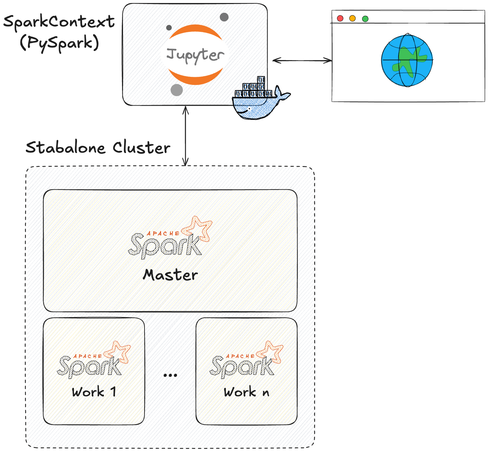

<p align="center">
    <br><br>
</p>


# SouDevCon - 2025
## A Celebração das Linguagens de Programação!

Repositório com material utilizado no minicurso: Aprendizado de Máquina com Dados em Larga Escala.


## 🔖 Resumo

Com o crescimento exponencial da geração de dados, o aprendizado de máquina em larga escala tornou-se uma habilidade essencial para lidar com os desafios do Big Data. Neste minicurso iremos explorar como o PySpark, uma das principais ferramentas para processamento distribuído, pode ser aplicado na construção de modelos de machine learning eficientes em ambientes com grandes volumes de dados. Abordaremos os conceitos fundamentais de Big Data, a arquitetura distribuída do PySpark e suas estruturas essenciais, como RDDs e DataFrames. Além disso, veremos como construir pipelines de machine learning, realizar o pré-processamento eficiente e treinar modelos supervisionados e não supervisionados.


## 📖 Tópicos

- Introdução ao Big Data e Machine Learning em Larga Escala
- Fundamentos de PySpark para Machine Learning
- Construção de Modelos de Machine Learning com PySpark MLlib


## 🧪 Tecnologias

&rarr; <a href="https://spark.apache.org/docs/latest/api/python/index.html" target="_blank">PySpark</a> <br>
&rarr; <a href="https://jupyter.org/" target="_blank">Jupyter Notebook</a> <br>


## 🔌 Executando localmente

### 🔥 Requisitos:
- Docker e Docker Compose instalados
- Git

### 🏗️ Arquitetura proposta no docker compose:

<br><br>

### 👣 Passos:

1. Clone o projeto

```bash
$ git clone https://github.com/gesielrios/soudevcon-pyspark-ml.git
```

2. Acesse a pasta do projeto:

```bash
$ cd soudevcon-pyspark-ml
```

3. Build e up as imagens via docker compose com três workers:

```bash
$ docker-compose build
$ docker-compose up -d --scale spark-worker=3
```

4. Acesse: http://localhost:8888 

## 📝 Licença

Este projeto é distribuído sob licença MIT.